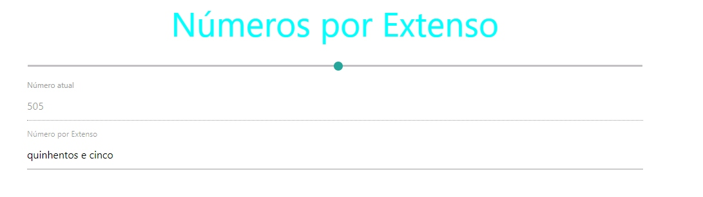

<h1 align="center">Números por Extenso</h1>
<h3>:computer: Sobre o projeto:</h3

Projeto criado durante o 1º módulo do bootcamp Fullstack da IGTI. Onde seu prósito era treinar funções básicas do javascript e treinar a lógica de programação.

<h3>:wrench: Funcionalidade</h3>

 Contagem de números de 0 a 999, atráves de um Input Range, identificar o número escolhido e escrever seu nome por extenso.

<h3>:calendar: Status do Projeto</h3>

Completo

<h3>:art:Layout</h3>

<strong>Se você se interessou e gostaria de testar, <a href="https://mands-codes.github.io/numeros_extenso-cursoIGTI/">clique aqui</a></strong>

<h3>☑️ Tecnologias</h3>

A ferramenta a seguir foi utilizada na construção do layout do projeto

<a href="https://materializecss.com/">Materialize</a>
